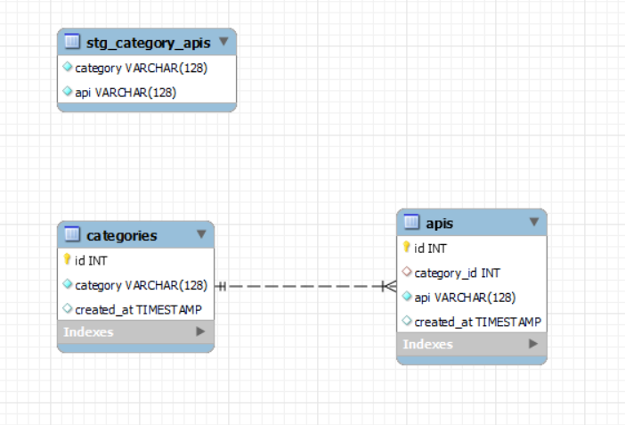

## Postman Data Engineering Round 2 (2022)
The goal of this [problem statement](https://documenter.getpostman.com/view/4796420/SzmZczsh?version=latest) is to stream data from an api and store it into a Relational Database (In my case, I have used [mysql](https://www.mysql.com/products/workbench/)).

## Notes and Quick Start
1. Use [python >= 3.7.6](https://www.python.org/downloads/release/python-376/) and [mysql](https://www.mysql.com/products/workbench/) database

2. Install dependencies
```console
python -m pip install -r requirements.txt
```

3. Update database credentials in [db.toml](./db.toml) file

4. Run the script
```console
python ./run.py
```

5. The database should be populated with the apis info (see database schema [here](#database-schema))

## Flow Diagram
The following diagram shows roughly what tasks are running in the script. I have used [prefect](https://docs.prefect.io/) to orchestrate these tasks. The flow is ran using `LocalDaskExecutor`.

1. refresh_stg_category_apis_taskfn - downloads and stores latest apis data into db

2. update_dwh_categories_taskfn - updates `categories` table in db with new categories

3. update_dwh_apis_taskfn - updates `apis` table in db with new apis


## Database Schema
You can see table details as code [here](./db/tables.py).



## Table Row Counts
| table_name | counts |
| ---------- | ------ |
stg_category_apis | 640
categories | 45
apis | 640

Query to get row counts-

```sql
SELECT
	'stg_category_apis' table_name,
	COUNT(1) count
FROM github_api_repo.stg_category_apis
UNION
SELECT
	'categories' table_name,
	COUNT(1) count
FROM github_api_repo.categories
UNION
SELECT
	'apis' table_name,
	COUNT(1) count
FROM github_api_repo.apis ;
```